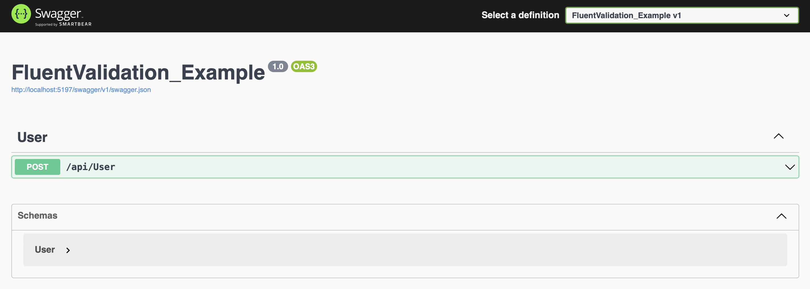
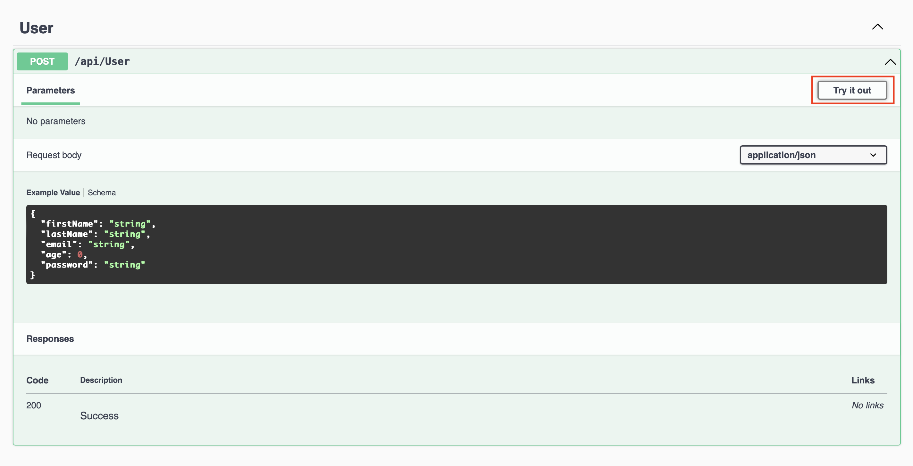
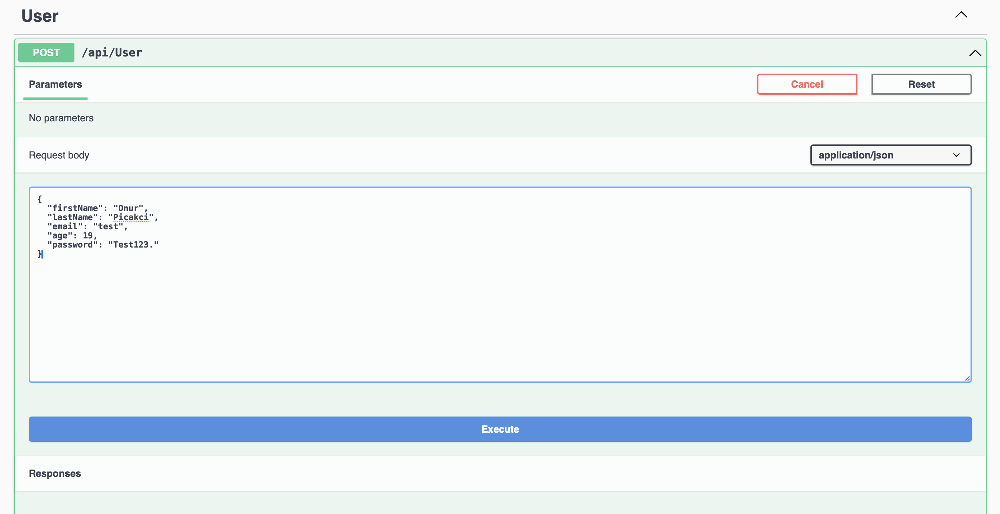
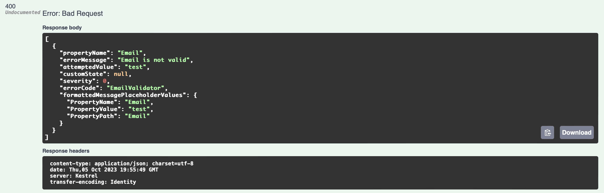
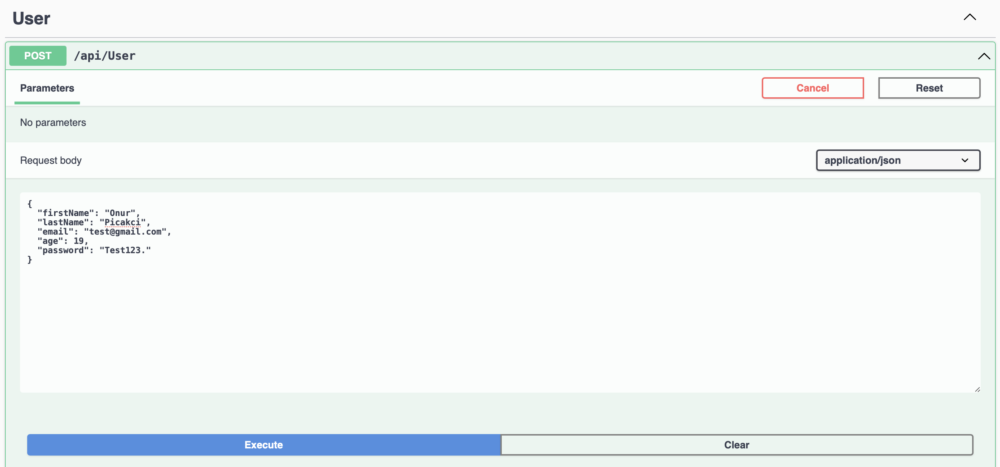
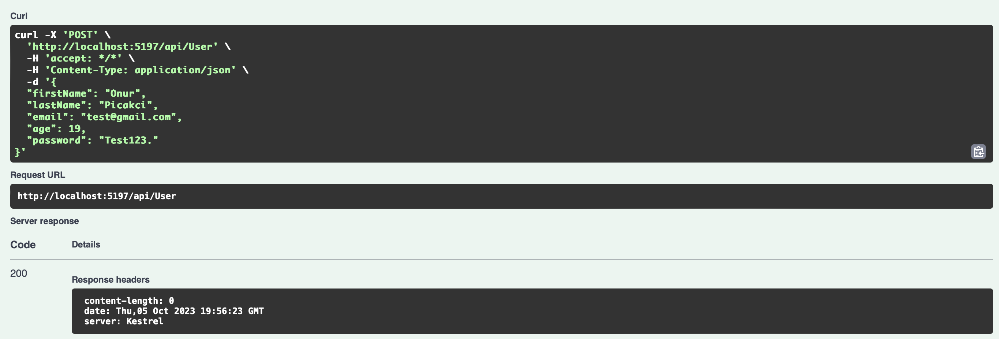

# Introduction
Used to prevent errors and ensure data integrity in an application, data validation plays a crucial role. You can do this in many ways with .NET Core, but in this article, we will use the very common FluentValidation library.

# What is FluentValidation?

FluentValidation is a .NET library that provides a fluent interface for defining validation rules in your applications. It is commonly used in C# and other .NET languages to simplify the process of validating objects and their properties.

Important points about FluentValidation:

 **Fluent Interface:** FluentValidation allows to definition of validation rules in a fluent way to make the code more readable and easy to understand.

 **Separation of Concerns:** For cleaner and more modular code, FluentValidation keeps the validation logic separate from the domain model.

 **Integration with ASP.NET and MVC Frameworks:** It is commonly used in conjunction with ASP.NET and ASP.NET MVC for server-side validation. It integrates well with the model binding process in these frameworks.

 **Unit Testing:** FluentValidation supports unit testing of validation rules so you can test easily.

# Validating ASP.NET Code with FluentValidation

In this article, you will create a validation using FluentValidation and code a simple API.

You can access the source code of what we did in the article on my [Github](https://github.com/onurpicakci/FluentValidation-Example).

## Requirements
- .NET 
- An IDE you use (Visual Studio Code / Rider)
- FluentValidation NuGet Package

## 1. Adding FluentValidation Nuget Package to a Project

To use FluentValidation in our application, you need to install the Nuget Package/Library.

```bash
dotnet add package FluentValidation
```

## 2. Create Validation Rules

The Validator you create in this step should inherit from `AbstractValidator<T>` and rules should be created.

```csharp
public class UserValidator : AbstractValidator<User>
{
    public UserValidator()
    {
        RuleFor(x => x.FirstName).NotEmpty().WithMessage("First Name cannot be empty");
        RuleFor(x => x.LastName).NotEmpty().WithMessage("Last Name cannot be empty");
        RuleFor(x => x.Email).NotEmpty().WithMessage("Email cannot be empty");
        RuleFor(x => x.Email).EmailAddress().WithMessage("Email is not valid");
        RuleFor(x => x.Age).NotEmpty().WithMessage("Age cannot be empty");
        RuleFor(x => x.Age).InclusiveBetween(18, 65).WithMessage("Age must be between 18 and 65");
        RuleFor(x => x.Password).NotEmpty().WithMessage("Password cannot be empty");
        RuleFor(x => x.Password).MinimumLength(5).WithMessage("Password cannot be less than 5 characters");
        RuleFor(x => x.Password).MaximumLength(100).WithMessage("Password cannot be more than 100 characters");
        
    }
}
```

## 3. Register the Validator in the Program.cs

Add verification to the service provider.

```csharp
builder.Services.AddScoped<IValidator<User>, UserValidator>();
```

## 4. Use Your Validation in Your App

You should use data validation in your application. In this application we will use it through a controller.

```csharp
[Route("api/[controller]")]
[ApiController]
public class UserController : ControllerBase
{
    private readonly IValidator<User> _validator;

    public UserController(IValidator<User> validator)
    {
        _validator = validator;
    }

    [HttpPost]
    public async Task<IActionResult> Post(User user)
    {
        var validationResult = await  _validator.ValidateAsync(user);
        if (!validationResult.IsValid)
        {
            return BadRequest(validationResult.Errors);
        }

        return Ok();
    }
}
```

## Testing the API

Run the API to test Validation. You can also test it using Postman, but we will go through Swagger here.

First, run the API with the IDE you are using




Then click `/api/User'` and a tab like the one in the image will open. Click on the `Try it out` button to test it.



Let's first test if our validation works by entering the wrong data type. We added a validation to enter email in the email type. That's why I am entering the email in an improper format.



Then we will see below that it gives an error and the error code returns 400. Everything is great our validation seems to be working as we want.



Let's enter all the data correctly according to our validation and make sure it works smoothly.



After pressing the Execute button, we will see below that it returns 200. That's everything exactly as we want it.



## Conclusion

As a result, FluentValidation stands out as a powerful tool in the arsenal of any ASP.NET developer looking for robust and sustainable data validation. Its fluid interface simplifies the often complex process of defining validation rules, making the code easier to read and understand.  I tried my best to show you how to use this library and I hope it was useful. Hope to see you in my different articles.

## References

- https://docs.fluentvalidation.net/en/latest/